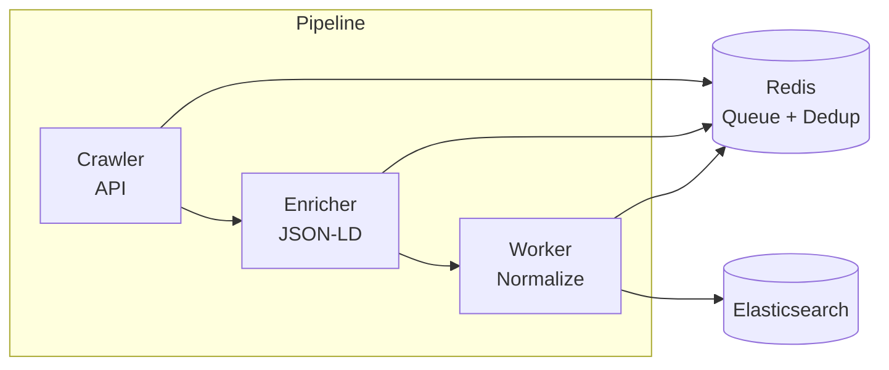

# Go Crawler - Vieclam24h

Hệ thống crawler việc làm từ [Vieclam24h.vn](https://vieclam24h.vn), xây dựng bằng Go với kiến trúc microservices.

## Tính năng

- **Crawler**: Thu thập dữ liệu từ API Vieclam24h
- **Enricher**: Bổ sung dữ liệu từ JSON-LD (trang chi tiết)
- **Worker**: Chuẩn hóa và lưu vào Elasticsearch
- **Deduplication**: Tránh crawl trùng lặp với Redis
- **Queue System**: Xử lý bất đồng bộ với Redis List

## Kiến trúc



## Quick Start

### Prerequisites

- Docker & Docker Compose
- Go 1.24+ (for development)
- jq (optional, for Makefile commands)

### Chạy với Docker

```bash
# Start all services
make up

# Xem logs
make logs

# Kiểm tra số lượng jobs
make count

# Xem sample data
make sample

# Check Elasticsearch health
make es-health

# Dừng services
make down

# Reset toàn bộ (xóa data)
make reset
```

### Development

```bash
# Build all
make build

# Run tests
make test

# Check queues
make queues
```

## Elasticsearch Index

Index: `jobs_vieclam24h`

| Field | Type | Description |
| ----- | ---- | ----------- |
| `id` | keyword | Job ID |
| `title` | text | Tiêu đề (Vietnamese analyzer) |
| `company` | text | Tên công ty |
| `location` | text | Địa chỉ |
| `location_city` | keyword[] | Tỉnh/Thành phố |
| `location_district` | keyword[] | Quận/Huyện |
| `salary` | text | Mức lương (text) |
| `salary_min` | integer | Lương tối thiểu (triệu) |
| `salary_max` | integer | Lương tối đa (triệu) |
| `is_negotiable` | boolean | Thỏa thuận |
| `experience` | keyword | Kinh nghiệm |
| `experience_tags` | keyword[] | Tags: A,B,C,D,E,F |
| `industry` | keyword[] | Ngành nghề |
| `qualifications` | keyword | Học vấn |
| `description` | text | Mô tả công việc |
| `requirements` | text | Yêu cầu |
| `benefits` | text | Phúc lợi |
| `skills` | keyword[] | Kỹ năng |

## 📁 Project Structure

```
go-crawler/
├── cmd/
│   ├── vieclam24h/        # Crawler & Enricher services
│   └── worker/            # Worker service
├── internal/
│   ├── module/vieclam24h/ # Vieclam24h specific logic
│   ├── common/
│   │   ├── dedup/         # Deduplication
│   │   ├── queue/         # Redis queue
│   │   ├── indexer/       # Elasticsearch indexer
│   │   └── normalizer/    # Data normalization
│   └── domain/            # Domain models
├── docker-compose.yml
├── Makefile
└── README.md
```

## Configuration

Environment variables trong `docker-compose.yml`:

| Variable | Default | Description |
| -------- | ------- | ----------- |
| `REDIS_ADDR` | `redis:6379` | Redis connection |
| `ELASTICSEARCH_URL` | `http://elasticsearch:9200` | ES connection |
| `ELASTICSEARCH_INDEX` | `jobs_vieclam24h` | ES index name |
| `CRAWLER_DELAY_MS` | `2000` | Delay giữa requests (ms) |

## 📖 Documentation

- [Vieclam24h Data Pipeline](./vieclam24h.md) - Chi tiết về data flow và field mapping

## License

MIT License

Copyright (c) 2026 Project TKTT

Permission is hereby granted, free of charge, to any person obtaining a copy
of this software and associated documentation files (the "Software"), to deal
in the Software without restriction, including without limitation the rights
to use, copy, modify, merge, publish, distribute, sublicense, and/or sell
copies of the Software, and to permit persons to whom the Software is
furnished to do so, subject to the following conditions:

The above copyright notice and this permission notice shall be included in all
copies or substantial portions of the Software.

THE SOFTWARE IS PROVIDED "AS IS", WITHOUT WARRANTY OF ANY KIND, EXPRESS OR
IMPLIED, INCLUDING BUT NOT LIMITED TO THE WARRANTIES OF MERCHANTABILITY,
FITNESS FOR A PARTICULAR PURPOSE AND NONINFRINGEMENT. IN NO EVENT SHALL THE
AUTHORS OR COPYRIGHT HOLDERS BE LIABLE FOR ANY CLAIM, DAMAGES OR OTHER
LIABILITY, WHETHER IN AN ACTION OF CONTRACT, TORT OR OTHERWISE, ARISING FROM,
OUT OF OR IN CONNECTION WITH THE SOFTWARE OR THE USE OR OTHER DEALINGS IN THE
SOFTWARE.
