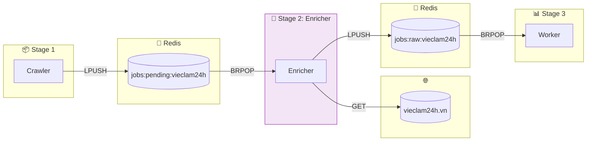
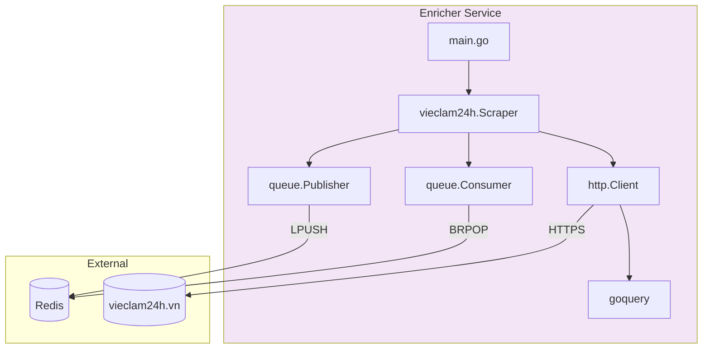
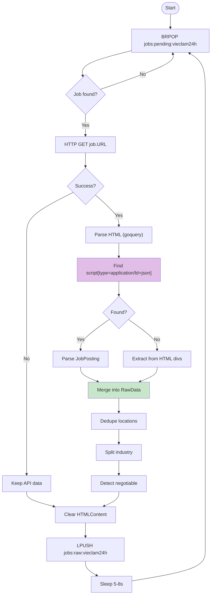
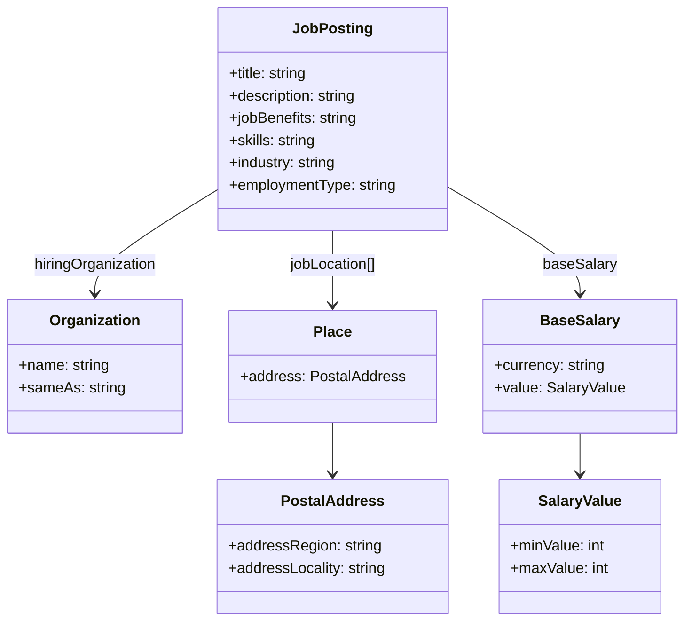
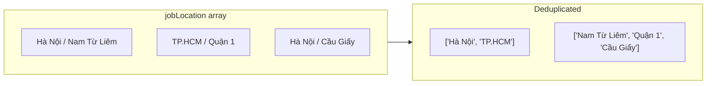
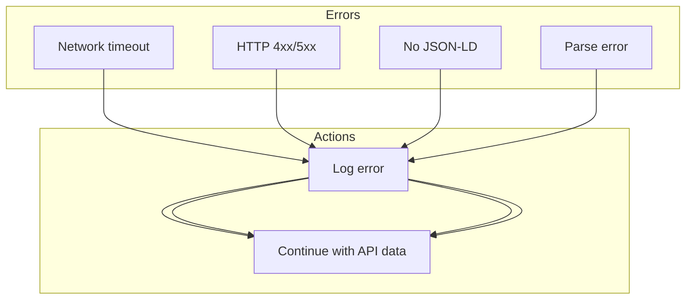

# Vieclam24h Enricher

**Stage 2** trong pipeline - Scrape HTML detail page để bổ sung dữ liệu chi tiết từ JSON-LD.

---

## 1. Tổng quan

### 1.1 Chức năng chính

- **Queue Consumption**: Đọc `RawJob` từ queue `jobs:pending:vieclam24h`
- **HTML Fetching**: Scrape HTML từ detail page của job
- **JSON-LD Extraction**: Parse structured data từ Schema.org JobPosting
- **Data Enrichment**: Bổ sung thông tin vào `RawData`
- **Queue Publishing**: Push enriched job vào queue `jobs:raw:vieclam24h`

### 1.2 Vị trí trong Pipeline



---

## 2. Kiến trúc



---

## 3. Input

### 3.1 Queue Source

| Property | Value |
|----------|-------|
| Queue Name | `jobs:pending:vieclam24h` |
| Redis Command | `BRPOP` (timeout: 5s) |
| Format | JSON-encoded `RawJob` |

### 3.2 RawJob từ Crawler

```json
{
  "id": "200734388",
  "url": "https://vieclam24h.vn/ky-thuat-vien-c15p1id200734388.html",
  "source": "vieclam24h",
  "raw_data": {
    "jobId": 200734388,
    "jobTitle": "Kỹ Thuật Viên Lắp Đặt",
    "companyName": "Công Ty ABC",
    "salaryFrom": 8000000,
    "salaryTo": 15000000,
    "provinceIds": [1, 8]
  }
}
```

### 3.3 Các trường thiếu từ API

| Field | Lý do cần từ HTML |
|-------|-------------------|
| `jobDescription` | API không có mô tả chi tiết |
| `jobBenefits` | API không có thông tin quyền lợi |
| `skills` | API không có danh sách kỹ năng |
| `locationCity` | API chỉ có ID, cần tên |
| `companyWebsite` | API không có |

---

## 4. Luồng xử lý



---

## 5. HTML Parsing

### 5.1 JSON-LD Structure

```html
<script type="application/ld+json">
{
  "@context": "https://schema.org",
  "@type": "JobPosting",
  "title": "Kỹ Thuật Viên Lắp Đặt",
  "description": "Mô tả chi tiết công việc...",
  "jobBenefits": "BHXH, BHYT, thưởng Tết...",
  "skills": "PLC, SCADA, AutoCAD",
  "industry": "Điện - Điện tử, Cơ khí",
  "hiringOrganization": {
    "name": "Công Ty ABC",
    "sameAs": "https://abc.vn"
  },
  "jobLocation": [
    {
      "address": {
        "addressRegion": "Hà Nội",
        "addressLocality": "Nam Từ Liêm"
      }
    }
  ],
  "baseSalary": {
    "currency": "VND",
    "value": {
      "minValue": 8000000,
      "maxValue": 15000000
    }
  }
}
</script>
```

### 5.2 Schema Diagram



### 5.3 Location Deduplication



### 5.4 Experience Text (from HTML)

```html
<div class="flex flex-col">
  <div>Kinh nghiệm</div>
  <div>1 năm</div>
</div>
```

---

## 6. Output

### 6.1 Queue

| Property | Value |
|----------|-------|
| Queue Name | `jobs:raw:vieclam24h` |
| Redis Command | `LPUSH` |

### 6.2 New Fields Added

| Field | Source | Type |
|-------|--------|------|
| `jobDescription` | JSON-LD | string |
| `jobBenefits` | JSON-LD | string |
| `skills` | JSON-LD | string |
| `industry` | JSON-LD | []string |
| `locationCity` | JSON-LD | []string |
| `locationDistrict` | JSON-LD | []string |
| `companyWebsite` | JSON-LD | string |
| `experienceText` | HTML | string |
| `isNegotiable` | JSON-LD | bool |
| `salaryMinJsonLd` | JSON-LD | int |
| `salaryMaxJsonLd` | JSON-LD | int |

### 6.3 Field Priority

| Field | Priority 1 | Priority 2 |
|-------|------------|------------|
| Salary | `salaryMinJsonLd` | `salaryFrom` |
| Location | `locationCity[]` | `provinceIds` |
| Experience | `experienceText` | `experienceRange` |

---

## 7. Error Handling



| Error | Action |
|-------|--------|
| Fetch timeout | Log, continue with API data |
| HTTP 404 | Log, continue |
| HTTP 403/429 | Log, increase delay |
| No JSON-LD | Log, try HTML parsing |
| Parse error | Log, continue |

---

## 8. Cấu hình

| Config | Default | Mô tả |
|--------|---------|-------|
| `delay` | 5s | Delay giữa requests |
| HTTP Timeout | 30s | Timeout cho request |
| Queue Timeout | 5s | BRPOP timeout |

### Environment Variables

| Variable | Default |
|----------|---------|
| `REDIS_ADDR` | `redis:6379` |
| `REDIS_JOB_QUEUE` | `jobs:raw:vieclam24h` |
| `CRAWLER_DELAY_MS` | `5000` |

---

## 9. Code Reference

| Component | Path |
|-----------|------|
| Entry Point | `cmd/vieclam24h/enricher/main.go` |
| Scraper | `internal/module/vieclam24h/scraper.go` |
| Types | `internal/module/vieclam24h/types.go` |

---

## 10. Troubleshooting

### Check queues

```bash
redis-cli LLEN jobs:pending:vieclam24h
redis-cli LLEN jobs:raw:vieclam24h
```

### Check logs

```bash
docker logs vl24h-enricher
```

### Test JSON-LD

```bash
curl -s "https://vieclam24h.vn/job-url.html" | grep "application/ld+json"
```

### Clear queues

```bash
redis-cli DEL jobs:pending:vieclam24h
```

### Common Issues

| Issue | Solution |
|-------|----------|
| Timeout | Increase HTTP timeout |
| 403/429 | Increase delay to 10-15s |
| No JSON-LD | Accept partial data |
