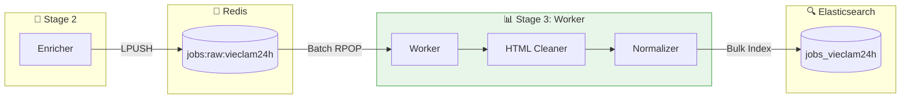
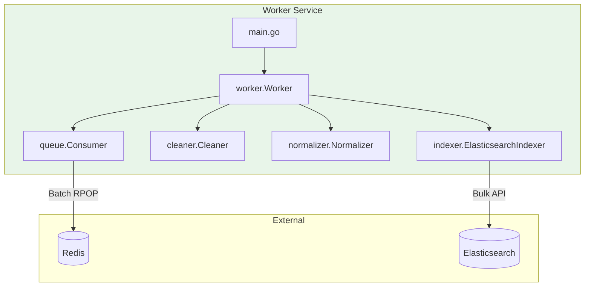
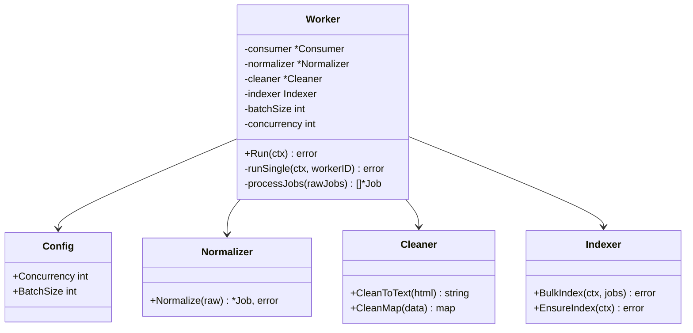
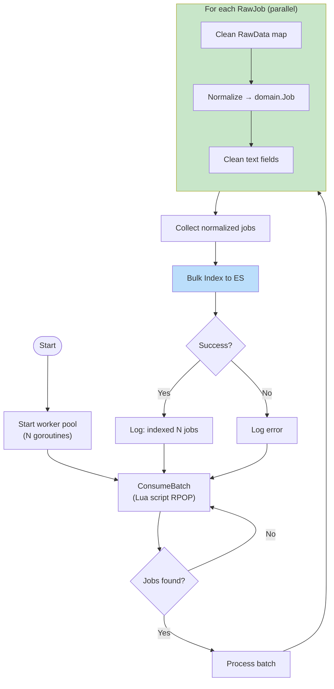
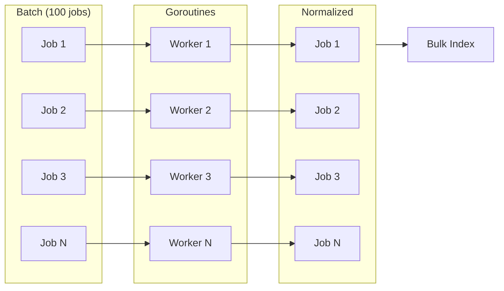
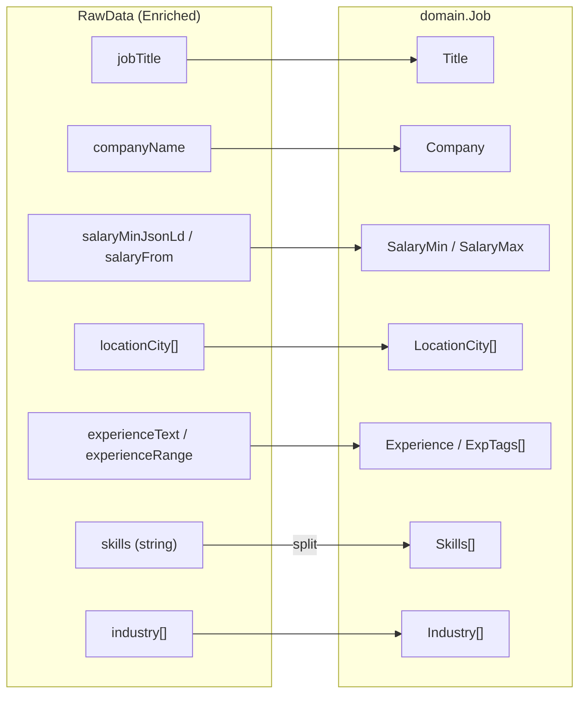
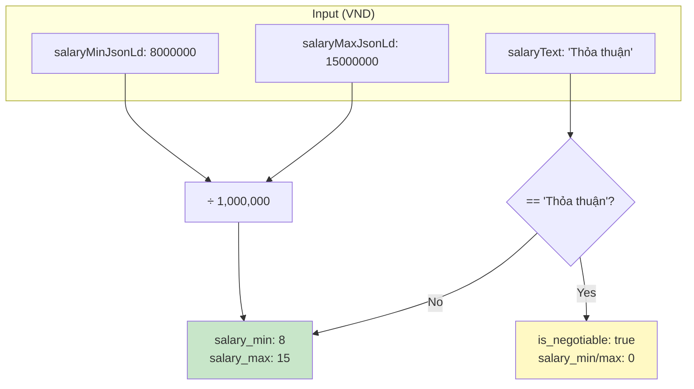
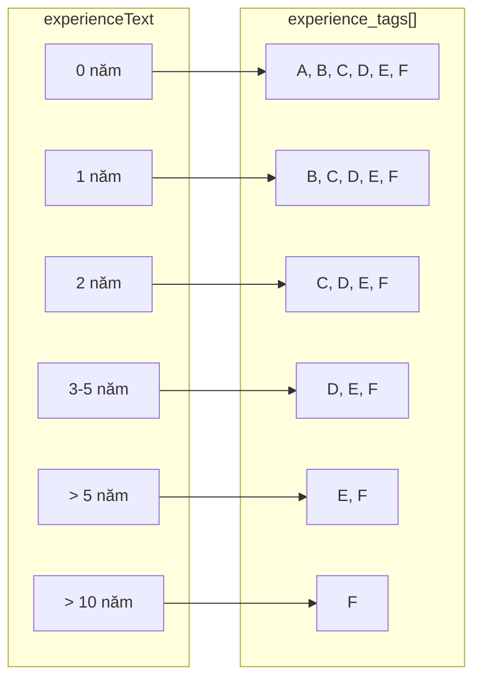

# Vieclam24h Worker

**Stage 3** trong pipeline - Normalize dữ liệu và index vào Elasticsearch.

---

## 1. Tổng quan

### 1.1 Chức năng chính

- **Queue Consumption**: Batch consume từ queue `jobs:raw:vieclam24h`
- **HTML Cleaning**: Strip tags, normalize Unicode
- **Normalization**: Chuyển đổi về format `domain.Job`
- **Bulk Indexing**: Index vào Elasticsearch

### 1.2 Vị trí trong Pipeline



---

## 2. Kiến trúc



### 2.1 Class Structure



---

## 3. Input

### 3.1 Queue Source

| Property | Value |
|----------|-------|
| Queue Name | `jobs:raw:vieclam24h` |
| Consume Method | Batch RPOP (Lua script) |
| Batch Size | 100 (configurable) |

### 3.2 Enriched RawJob

```json
{
  "id": "200734388",
  "url": "https://vieclam24h.vn/...",
  "source": "vieclam24h",
  "raw_data": {
    "jobId": 200734388,
    "jobTitle": "Kỹ Thuật Viên Lắp Đặt",
    "companyName": "Công Ty ABC",
    "salaryFrom": 8000000,
    "salaryTo": 15000000,
    "salaryMinJsonLd": 8000000,
    "locationCity": ["Hà Nội", "TP.HCM"],
    "experienceText": "1 năm",
    "jobDescription": "Mô tả công việc...",
    "skills": "PLC, SCADA, AutoCAD",
    "industry": ["Điện - Điện tử", "Cơ khí"]
  }
}
```

---

## 4. Luồng xử lý



### 4.1 Parallel Processing



---

## 5. Normalization

### 5.1 Field Mapping



### 5.2 Salary Conversion



**Priority:** `salaryMinJsonLd` > `salaryFrom`

### 5.3 Experience Tags



| Tag | Meaning |
|-----|---------|
| A | Phù hợp 0-1 năm |
| B | Phù hợp 1-2 năm |
| C | Phù hợp 2-3 năm |
| D | Phù hợp 3-5 năm |
| E | Phù hợp 5-10 năm |
| F | Phù hợp 10+ năm |

### 5.4 Skills Parsing

```
Input:  "PLC, SCADA, AutoCAD"
Output: ["PLC", "SCADA", "AutoCAD"]
```

### 5.5 HTML Cleaning

```go
job.Description = cleaner.CleanToText(job.Description)
job.Requirements = cleaner.CleanToText(job.Requirements)
job.Benefits = cleaner.CleanToText(job.Benefits)
```

- Strip HTML tags
- Normalize Unicode
- Trim whitespace
- Remove empty lines

---

## 6. Output

### 6.1 Elasticsearch Index

| Property | Value |
|----------|-------|
| Index Name | `jobs_vieclam24h` |
| Method | Bulk API |
| Analyzer | Vietnamese (lowercase + asciifolding) |

### 6.2 Document Format

```json
{
  "id": "200734388",
  "source": "vieclam24h",
  "source_url": "https://vieclam24h.vn/...",
  "title": "Kỹ Thuật Viên Lắp Đặt",
  "company": "Công Ty ABC",
  "location": "Nam Từ Liêm, Hà Nội",
  "location_city": ["Hà Nội", "TP.HCM"],
  "location_district": ["Nam Từ Liêm", "Quận 1"],
  "salary": "8 - 15 triệu",
  "salary_min": 8,
  "salary_max": 15,
  "is_negotiable": false,
  "experience": "1 năm",
  "experience_tags": ["B", "C", "D", "E", "F"],
  "industry": ["Điện - Điện tử", "Cơ khí"],
  "skills": ["PLC", "SCADA", "AutoCAD"],
  "description": "Mô tả công việc (plain text)...",
  "requirements": "Yêu cầu (plain text)...",
  "benefits": "Quyền lợi (plain text)...",
  "total_views": 150,
  "total_resume_applied": 20,
  "rate_response": 95,
  "expired_at": "2025-02-04T23:59:59Z",
  "crawled_at": "2025-01-09T19:00:00Z"
}
```

### 6.3 Elasticsearch Mapping

```json
{
  "mappings": {
    "properties": {
      "id": {"type": "keyword"},
      "source": {"type": "keyword"},
      "title": {"type": "text", "analyzer": "vietnamese"},
      "company": {"type": "text", "analyzer": "vietnamese"},
      "description": {"type": "text", "analyzer": "vietnamese"},
      "location_city": {"type": "keyword"},
      "location_district": {"type": "keyword"},
      "salary_min": {"type": "integer"},
      "salary_max": {"type": "integer"},
      "is_negotiable": {"type": "boolean"},
      "experience_tags": {"type": "keyword"},
      "skills": {"type": "keyword"},
      "industry": {"type": "keyword"},
      "expired_at": {"type": "date"},
      "crawled_at": {"type": "date"}
    }
  }
}
```

---

## 7. Cấu hình

| Config | Default | Mô tả |
|--------|---------|-------|
| `Concurrency` | 5 | Số worker goroutines |
| `BatchSize` | 100 | Số jobs mỗi batch |

### Environment Variables

| Variable | Default |
|----------|---------|
| `REDIS_ADDR` | `redis:6379` |
| `REDIS_JOB_QUEUE` | `jobs:raw:vieclam24h` |
| `ELASTICSEARCH_URL` | `http://elasticsearch:9200` |
| `ELASTICSEARCH_INDEX` | `jobs_vieclam24h` |
| `WORKER_CONCURRENCY` | `5` |
| `WORKER_BATCH_SIZE` | `100` |

---

## 8. Sample Queries

### Count documents

```bash
curl localhost:9200/jobs_vieclam24h/_count
```

### Search by keyword

```bash
curl localhost:9200/jobs_vieclam24h/_search?q=developer
```

### Filter by city

```bash
curl -X POST localhost:9200/jobs_vieclam24h/_search \
  -H 'Content-Type: application/json' -d '
{
  "query": {"term": {"location_city": "Hà Nội"}}
}'
```

### Filter by salary

```bash
curl -X POST localhost:9200/jobs_vieclam24h/_search \
  -H 'Content-Type: application/json' -d '
{
  "query": {"range": {"salary_min": {"gte": 10, "lte": 20}}}
}'
```

### Filter by experience

```bash
curl -X POST localhost:9200/jobs_vieclam24h/_search \
  -H 'Content-Type: application/json' -d '
{
  "query": {"term": {"experience_tags": "C"}}
}'
```

---

## 9. Code Reference

| Component | Path |
|-----------|------|
| Entry Point | `cmd/worker/main.go` |
| Worker | `internal/module/worker/worker.go` |
| Normalizer | `internal/common/normalizer/normalizer.go` |
| Cleaner | `internal/common/cleaner/cleaner.go` |
| Indexer | `internal/common/indexer/elasticsearch.go` |

---

## 10. Troubleshooting

### Check queue

```bash
redis-cli LLEN jobs:raw:vieclam24h
```

### Check ES health

```bash
curl localhost:9200/_cluster/health
curl localhost:9200/jobs_vieclam24h/_count
```

### Check logs

```bash
docker logs worker
```

### Clear queue

```bash
redis-cli DEL jobs:raw:vieclam24h
```

### Reindex

```bash
curl -X DELETE localhost:9200/jobs_vieclam24h
docker restart worker
```

### Common Issues

| Issue | Solution |
|-------|----------|
| ES connection failed | Check ES health, restart |
| Mapping conflict | Delete index, restart worker |
| Normalization error | Check logs for field issues |
| Queue empty | Check enricher is running |
